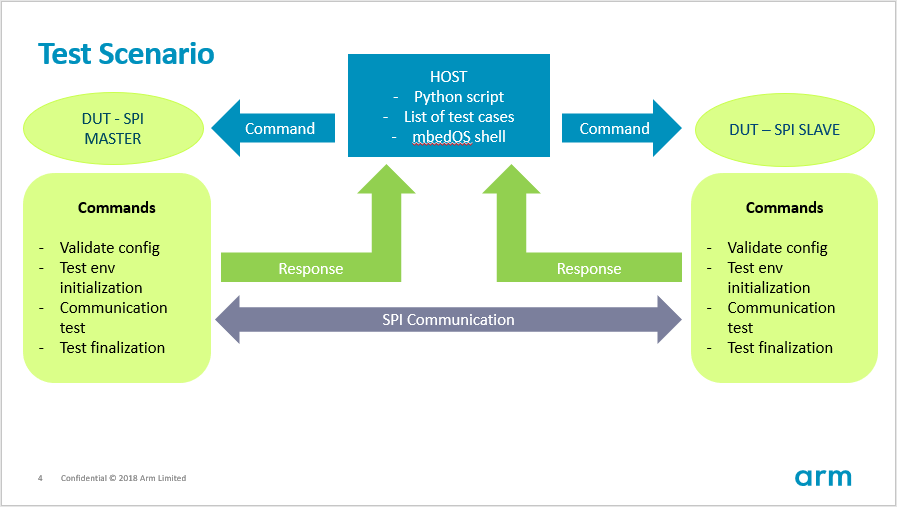
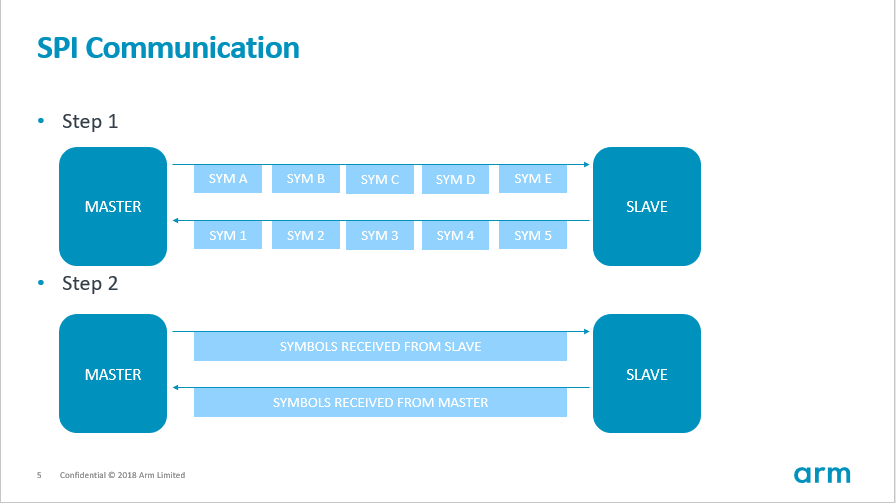

SPI Communication Test
=============

Testcases
---------

### test_spi_com

**Description**  
This is the SPI communication test which verifies various SPI configuration variants.
This test transfers data between SPI master and SPI slave.
Two boards are required with SPI peripheral available and slave/master mode support.    

To run the test using same boards as master and slave perform the following steps:  
 1. Adjust configuration to your needs in `./TEST_APPS/device/spi_common/mbed_app.json.`  
 2. Connect SPI interfaces as configured in `./TEST_APPS/device/spi_common/mbed_app.json`.  
 3. Execute the following command:  
 `mbed test -m BOARD -t TOOLCHAIN --icetea --app-config ./TEST_APPS/device/spi_common/mbed_app.json -n SPI_COM*`

Note:  
Above command will run all SPI communication test cases. To run only one test case type its full name.

Note:  
It is possible to use two different boards for SPI master and SPI slave, but the test must be  run using IceTea (not mbed test). Check the manual for more details.  

Note:  
Remember to connect also ground pins between boards.  

**Mbed app config**  
 - `SPI_MASTER/SLAVE_CS`: master/slave chip select pin,    
 - `SPI_MASTER/SLAVE_MOSI`: master/slave mosi pin,  
 - `SPI_MASTER/SLAVE_MISO`: master/slave miso pin,  
 - `SPI_MASTER/SLAVE_MISO`: master/slave clk pin,  
 - `SPI_MASTER/SLAVE_DEBUG`: master/slave debug mode (0 or 1). If debug is enabled then tested configuration is dumped and transmission buffers are dumped in case of failure.  
 - `SPI_MASTER/SLAVE_DELAY`: Delay before the transmission in ms. We need to ensure that slave is ready for transmission.  
 - `SPI_MASTER/SLAVE_TRANSMISSION_START_BTN`: it is possible to define button to trigger the transmission manually. In such case set `SPI_MASTER_DELAY` to 0 and define `SPI_MASTER/SLAVE_TRANSMISSION_START_BTN`. If not used then set to `NC`.  
 - `SPI_MASTER/SLAVE_TRANSMISSION_START_LED`: set led which indicates delay before the transmission. Set `NC` if not used. 

**Which SPI features are verified by the test?**  
 - master/slave mode,  
 - synchronous/asynchronous modes,  
 - full duplex/half duplex modes,  
 - symbol sizes: [1, 32],  
 - clock polarity/phase,  
 - bit ordering during transmission,  
 - clock frequency,  
 - rx count == tx count, tx count != tx count,  
 - undefined rx/tx buffer,  
 - internal/external ss handling by master,  
 - transmission of one symbol / long buffer.  

**Test scenario**  

 Test environment is shown on the picture below:  
   
 
 Typical SPI transmission schema during the test is shown below:  
   

 - Tested configuration is transfered to master and slave.  
 - Configuration is validated against the capabilities by both sides(master and slave) and propriate status is sent back to the host.  
 - If master or slave can not handle the specific SPI configuration, then it is skipped and host tries next one.  
 - If configuration can be handled by both sides, then host requests to perform the SPI communication test.  
 - Status of the test is sent back to the host.  
 
 **Expected result:**  
 The test exits without errors.  
